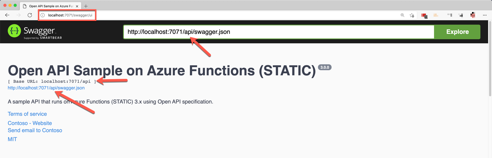
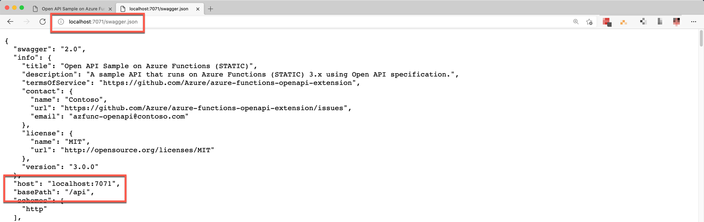

# Shortening Swagger UI Page URL and `swagger.json` URL with `proxies.json` #

With default implementation, Azure Functions OpenAPI extension has the following endpoint URLs:

* `https://<your_function_name>.azurewebsites.net/api/swagger/ui`
* `https://<your_function_name>.azurewebsites.net/api/swagger.json`
* `https://<your_function_name>.azurewebsites.net/api/swagger.yaml`

They are the entry point from the external access, and generally the `/api` segment is omitted. This can be easily done, by introducing the [`proxies.json` file](https://docs.microsoft.com/azure/azure-functions/functions-proxies?WT.mc_id=dotnet_0000_juyoo).


## Create `proxies.json` ##

To get both Swagger UI page URL and `swagger.json` document URL shortened, you need to create [`proxies.json`](https://docs.microsoft.com/azure/azure-functions/functions-proxies?WT.mc_id=dotnet_0000_juyoo) at the root of your Azure Functions project.

```json
{
  "$schema": "http://json.schemastore.org/proxies",
  "proxies": {
    "swaggerUI": {
      "matchCondition": {
        "methods": [ "GET" ],
        "route": "/swagger/ui"
      },
      "backendUri": "%OpenApi__BackendProxyUrl%/api/swagger/ui"
    },
    "swaggerDoc": {
      "matchCondition": {
        "methods": [ "GET" ],
        "route": "/swagger.{extension}"
      },
      "backendUri": "%OpenApi__BackendProxyUrl%/api/swagger.{extension}"
    }
  }
}
```

Make sure that `%OpenApi__BackendProxyUrl%` value MUST be set in your `local.settings.json` or application settings on Azure.


## Set `local.settings.json` or Application Settings ##

You need to add two app settings values. One is `%OpenApi__BackendProxyUrl%` stated above, and the other is `AZURE_FUNCTION_PROXY_DISABLE_LOCAL_CALL` like below:

```json
{
  "Values": {
    ...
    "AZURE_FUNCTION_PROXY_DISABLE_LOCAL_CALL": "true",
    ...
    "OpenApi__BackendProxyUrl": "http://localhost:7071",
    ...
  }
}
```

* `OpenApi__BackendProxyUrl`: Set this value to your Azure Functions app instance URL. If you are running the Function app locally, set this value to `http://localhost:7071`.
* `AZURE_FUNCTION_PROXY_DISABLE_LOCAL_CALL`: Set this value to `true`, if you are running the Function app on your local machine; otherwise, the Swagger UI page will complain while rendering.


## Add `proxies.json` to Function App Project Manifesto (`.csproj`) ##

Once you create the `proxies.json` file, it needs to be included while compiling. Add the following lines to your `.csproj` file.

```xml
  <ItemGroup>
    <None Update="proxies.json">
      <CopyToOutputDirectory>PreserveNewest</CopyToOutputDirectory>
    </None>
  </ItemGroup>
```


## Run Function App ##

Run the following command to confirm whether the proxy URL works OK or not.

```bash
func host start
```

You can find out the URL has `/api` omitted.





> However, make sure that it only omits from both entries, not the entire pages. Routing prefix still honours where defined in `host.json`.
